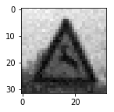

**Traffic Sign Recognition** 

The goals / steps of this project are the following:

* Step 1: loading and visualizing images and labels for training/validation/testing
* Step 2: preprocessing images
* Step 3: building a multilayer neural network model to predict signs 
* Step 4: optimizing model's cost and tuning weights/biases
* Step 5: evaluating the model based on validation set
* Step 6: downloading and testing a few extra samples from the web (analyzing them by precision and recall of each sign)
* Step 7: evaluating test set
* Step 8: visualizing feature map with sample image from test set
* goal : achieving a high accuracy on test images 

### Dataset Exploration

Dataset in this expermient consists of 32x32 images with 3 channels and 43 labels of traffic signs. 
 * Training data size: 34799
 * Validation data size: 4410
 * Testing data size: 12630
 * Note: after adding noise to training set , its size increases to 35299
 
I visualized training-set based on the frequency of signs to get a better undesrtanding of how well data is distrubuted and if the number of images (for each sign) in the set has a direct impact on the accuracy of model to predict labels.

As shown above, some of the signs such as [0-Speed limit (20km/h)] , [19-Dangerous curve to the left] or [37-Go straight or left] have very few samples in comparison to other signs with frequecy higher than 1200 such as [1-Speed limit (30km/h)]; and depending on image qualities this might affect the model accuracy on predicting signs with fewer samples in training set.

Picking random images from training set also shows that not all images have good qualities. Dark shades or bad sun exposure can make signs look similar to some of the other signs which can also introduce noise into the model. One sample is shown below

## Design and Test a Model Architecture

### Preprocessing
Although colors play an important role to show the type of traffic signs, there are also variety of reasons which might affect these colors and how they're reflected to drivers; including dark shadows of trees/mountains or different sun angles thorughout the day. In order to train the network independenlty from the color-factor and to reduce complexity, I performed a preprocessing step on images to convert them to grayscale and cutting down 3-channels to only 1-channel, I also normalized images to have mean 0 and equal variance, to get a better distribution which doesn't change the content of them image but helps optimization. Training-labels or Y-train are also converted to one-hot format.

Preprocessing on 1 images:
<table style="width:100%">
  <tr>
    <th>Original Image</th>
    <th>Grayscale</th>
    <th>Normalized</th>
  </tr>
  <tr>
    <td></td>
    <td></td>
    <td></td>
  </tr>
</table>

After preprocessing step, images are ready to train the model, but in order to make model even more generalized, I added noise to `500` random images and appended them to the training set, which in result increase the size of training set to `35299`, which improved my model accuracy on 7 web-sample images experiment.

Here are 2 examples of extra images with added noise:
<table style="width:100%">
  <tr>
    <th>Normalized</th>
    <th>With Noise</th>
    <th>Normalized</th>
    <th>With Noise</th>
  </tr>
  <tr>
    <td></td>
    <td></td>
    <td></td>
    <td></td>
  </tr>
</table>

### Network
Network used for this exercise consists of 6 layers similar to LeNet structure, input layer, 4 hidden layers and output layer:
<ul>
<li><b>input layer:</b>  32x32x1 images connect with 5x5x1x6 weights to 1st hidden layer</li>
<li><b>conv1 layer:</b> 
  first convolutional layer with filter size of 5x5x1, depth of 6 and stride of 1.  
  After passing thorugh filters, biases are added and data gets actiavted with relu to add non-linearlity to the model 
  Pooling method used in this layer is max_pool with kernel size of 2 to reduce the size of output to 10x10x6. 
</li>
<li><b>conv2 layer:</b> 
2nd convolutional layer with filter size of 5x5x6, depth of 16 and stride of 1. 
Similar to previous layer, after passing thorugh filters, biases are added and data gets actiavted with relu 
Pooling method used in this layer is max_pool with kernel size of 2 to reduce the size of output to 5x5x16. 
</li>
<li><b>f1 layer:</b> 
it is a fully connected layer with 120 nodes, in order to pass outputs of conv2 layer to this layer, it should be reshaped to a flat array 400x1. Weights connecting conv2 to f1 are 400x120 and 120 biases are added to the output. 
Regularization method used in this layer is drop_out of 50% to prevent model from overfitting.
</li>
<li><b>f2 layer:</b> 
f2 is another fully connected layer with 84 nodes, connected with 120x84 weights from f1 layer and 84 biases. 
50% Drop_out is applied to this layer as well as f1.
</li>
<li><b>output layer:</b> 
is the final layer with 43 nodes, 84x43 weights and 43 biases, which classifies the results into 43 categories of signs.
</li></ul>
 
I started training with 10 epochs but the accuracy was below 90%, considering that learning-reat is 0.001 and 50% of data in f1 & f2 layers are dropping in each iteration, I increased epochs to 30 and achieved higher accuracy. Optimizer used in this network is Adamoptimzer which minimizes model's cost (cross-entropy) that is the distance of predicted-labels from target-labels. 
Final training configuration:
 - Optimizer: Adamoptimizer
 - learning-rate : 0.001
 - epochs: 30
 - batch-size : 128
 - drop_out: 0.5

### Evaluation
For measuring accuracy of each epoch, validation-set is passed to the model and the average number of correctly predicted labels is printed out, some of the iterations results:
<table style="width:100%">
  <tr>
    <td>Epoch</td>
    <td>1</td><td>2</td><td>3</td><td>4</td><td>...</td><td>28</td><td>29</td><td>30</td>
  </tr>
  <tr>
    <td>Accuracy</td>
    <td>0.572</td><td>0.807</td><td>0.852</td><td>0.874</td><td>...</td><td>0.948</td><td>0.958</td><td>0.954</td>
  </tr>
</table>

### Testing model on new images
In this practice, I found 7 sample images from web, preprocessed them and ran them through the model:
     

Overall accuracy shows `0.571`, model performs very well on the first 4 images but acts poorly on the rest of them
<table style="width:100%">
  <tr>
    <th>Image</th>
    <th colspan="2">Top 5 softmax probablities</th>
  </tr>
  <tr>
    <td>
    	 
    	1,Speed limit(30km/h) [Predicted: Correct]
    </td>
    <td>
    <ul>
     <li>probablity: 99.619384765625 , sign: 1,Speed limit (30km/h)</li>
     <li>probablity: 0.30610108375549316 , sign: 0,Speed limit (20km/h)</li>
     <li>probablity: 0.038351334631443024 , sign: 40,Roundabout mandatory</li>
     <li>probablity: 0.011021287180483341 , sign: 28,Children crossing</li>
     <li>probablity: 0.00678263371810317 , sign: 4,Speed limit (70km/h)</li>
     </ul>
    </td>
  </tr>
  <tr>
    <td>
    	 12,Priority road  [Predicted: Correct]
    </td>
    <td>
    <ul>
       <li>probablity: 100.0 , sign: 12,Priority road</li>
       <li>probablity: 4.700046076777653e-07 , sign: 40,Roundabout mandatory</li>
       <li>probablity: 1.1679628618421756e-11 , sign: 42,End of no passing by vehicles over 3.5 metric tons</li>
       <li>probablity: 4.077430260833806e-15 , sign: 7,Speed limit (100km/h)</li>
       <li>probablity: 4.875464999067405e-16 , sign: 1,Speed limit (30km/h)</li>
     </ul>
    </td>
  </tr>
  <tr>
    <td>
     14,Stop [Predicted: Correct]
    </td>
    <td>
    <ul>
     <li>probablity: 99.99876403808594 , sign: 14,Stop</li>
     <li>probablity: 0.001188850961625576 , sign: 38,Keep right</li>
     <li>probablity: 5.336221875040792e-05 , sign: 34,Turn left ahead</li>
     <li>probablity: 6.982488116591412e-07 , sign: 17,No entry</li>
     <li>probablity: 4.4473472371464595e-07 , sign: 13,Yield</li>
     </ul>
    </td>
  </tr>
  <tr>
    <td>
     
     25,Road work  [Predicted: Correct]
    </td>
    <td>
    <ul>
      <li>probablity: 80.46527862548828 , sign: 25,Road work</li>
      <li>probablity: 12.754717826843262 , sign: 31,Wild animals crossing</li>
      <li>probablity: 6.550268173217773 , sign: 21,Double curve</li>
      <li>probablity: 0.13391906023025513 , sign: 22,Bumpy road</li>
      <li>probablity: 0.04608609527349472 , sign: 20,Dangerous curve to the right</li>
    </ul>
    </td>
  </tr>
  <tr>
    <td>
    	 
     23,Slippery road  [Predicted: Incorrect] Actual Sign: 31,Wild animals crossing
    </td>
    <td>
    	<ul>
       <li>probablity: 100.0 , sign: 23,Slippery road</li>
       <li>probablity: 9.123946256295312e-07 , sign: 31,Wild animals crossing</li>
       <li>probablity: 8.476145012537017e-07 , sign: 20,Dangerous curve to the right</li>
       <li>probablity: 1.1697153468048782e-07 , sign: 30,Beware of ice/snow</li>
       <li>probablity: 3.1184420379304356e-08 , sign: 19,Dangerous curve to the left</li>
     </ul>
    </td>
  </tr>
  <tr>
    <td>
    	 
     11,Right-of-way at the nex.. [Predicted: Incorrect] Actual Sign: 23,Slippery road
    </td>
    <td>
    <ul>
      <li>probablity: 87.93341064453125 , sign: 11,Right-of-way at the next intersection</li>
      <li>probablity: 11.897724151611328 , sign: 31,Wild animals crossing</li>
      <li>probablity: 0.08555130660533905 , sign: 21,Double curve</li>
      <li>probablity: 0.04106033593416214 , sign: 30,Beware of ice/snow</li>
      <li>probablity: 0.019457001239061356 , sign: 37,Go straight or left</li>
     </ul>
    </td>
  </tr>
  <tr>
    <td>
    	 
     18,General caution [Predicted: Incorrect] Actual Sign: 21,Double curve
    </td>
    <td>
    <ul>
     <li>probablity: 82.82020568847656 , sign: 18,General caution</li>
     <li>probablity: 8.873628616333008 , sign: 25,Road work</li>
     <li>probablity: 6.7343974113464355 , sign: 20,Dangerous curve to the right</li>
     <li>probablity: 0.5950281023979187 , sign: 26,Traffic signals</li>
     <li>probablity: 0.4056157171726227 , sign: 38,Keep right</li>
     </ul>
    </td>
  </tr>
</table>

### Precision & Recall
To investigate these failures, I found 3 samples of training set for the failed images with their number of occurences in the set:
<table>
<tr>
<th>21,Double curve</th>
<th>31,Wild animals crossing</th>
<th>23,Slippery road</th>
</tr>
<tr>
<td></td>
<td></td>
<td></td>
</tr>
<tr>
<td>#occurrences : 270</td>
<td>#occurrences : 690</td>
<td>#occurrences : 450</td>
</tr>
</table>

Looking at the images brigns up a very clear point that these signs look very similar to each other and their number of samples is relateivly fewer than sign1 or sign25 with occurences of `1350` & `1980` to get a better insight on precision of the model, I plotted the precision and recall for each sign based on test set:

 * precision: TP /(TP+FP)
 * recall: TP/(TP+FN)
 

Sign `28` is predicted as `18`,and diagram shows `28`precision is low. But for sign 23 (predicted as 11) and sign 31 (predicted as 23) precisions and recalls are both high and I can't calim they're the reason why model is not performing good on these cases, so there might be other factors causing the failures such as noise or very similar sign shapes.

### Test validation
Overall accuracy for test set: `0.944`

### Feature map
Feature map depicted below is the result of sample image sign (1,Speed limit 30km/h) through `conv1` [Feature-maps 0-5] and `conv2` [Feature-maps 0-15] layers. 
One of the most interesting charactersitics in these feature maps is the figure-contours detected by network. `conv1` layer is focusing on the shape of 30 and the circle around the sign.
Output of `conv1` is max-pooled to a smaller pixel scale there are less pixels in `conv2`, so looks like its feature maps are more detailing out colors and orientations/locations of the colors.

